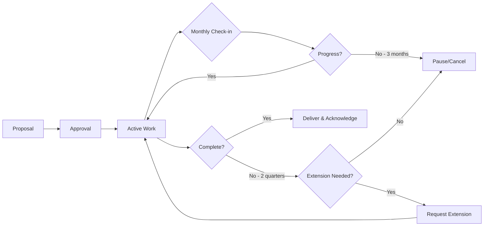

# CNCF Initiatives

Initiatives are lightweight, time-bound organizational units used for TAG or TOC work. They enable focused collaboration on specific deliverables while maintaining clear accountability and timelines.

## What is an Initiative?

An initiative is a short-term, scoped work effort with:

- **Pre-defined objectives**: Clear goals and expected outcomes
- **Exit criteria**: Specific conditions for completion
- **Time bounds**: Typically completed within 2 quarters (may be extended with justification)
- **Assigned oversight**: At least one TAG Tech Lead, Subproject Lead, or TOC member responsible
- **Active participation**: Minimum of 2 participants beyond the assigned lead

## Types of Initiatives

CNCF supports three types of initiatives, each with different formation and oversight requirements:

### TAG Initiatives

General initiatives aligned with the scope of a Technical Advisory Group, such as white papers, reports, or technical assessments.

**Oversight**: Managed by TAG Tech Leads, with at least one assigned as sponsor

**Examples**:
- Technical white papers on cloud native practices
- Landscape analysis reports
- Best practices documentation
- Cross-project integration studies

### Subproject Initiatives

Customized work efforts defined within a subproject's charter, tailored to meet specific subproject needs and tracked through GitHub issues.

**Oversight**: Managed by Subproject Leads

**Examples**:
- Security assessments for CNCF projects
- Project health reviews
- Contributor strategy implementations
- Mentoring program iterations

### TOC Initiatives

Initiatives created and owned by the TOC when work spans multiple TAGs or coordinates specific foundation-wide goals.

**Oversight**: At least one TOC member must be assigned to organize, shepherd, and report on status

**Examples**:
- Foundation-wide governance improvements
- Cross-TAG technical architecture initiatives
- Ecosystem-wide standards and practices
- Strategic planning and roadmap efforts

## Current Active Initiatives

To view current active initiatives across all groups:

| Initiative Type | GitHub Label | View Active |
|----------------|--------------|-------------|
| **TAG Developer Experience** | `tag/developer-experience` | [View Issues](https://github.com/cncf/toc/issues?q=state%3Aopen+label%3Akind%2Finitiative+label%3Atag%2Fdeveloper-experience) |
| **TAG Infrastructure** | `tag/infrastructure` | [View Issues](https://github.com/cncf/toc/issues?q=state%3Aopen+label%3Akind%2Finitiative+label%3Atag%2Finfrastructure) |
| **TAG Operational Resilience** | `tag/operational-resilience` | [View Issues](https://github.com/cncf/toc/issues?q=state%3Aopen+label%3Akind%2Finitiative+label%3Atag%2Foperational-resilience) |
| **TAG Security and Compliance** | `tag/security-and-compliance` | [View Issues](https://github.com/cncf/toc/issues?q=state%3Aopen+label%3Akind%2Finitiative+label%3Atag%2Fsecurity-and-compliance) |
| **TAG Workloads Foundation** | `tag/workloads-foundation` | [View Issues](https://github.com/cncf/toc/issues?q=state%3Aopen+label%3Akind%2Finitiative+label%3Atag%2Fworkloads-foundation) |
| **Contributor Strategy Subproject** | `sub/contributor-strategy-and-advocacy` | [View Issues](https://github.com/cncf/toc/issues?q=is%3Aopen+label%3Akind%2Finitiative+label%3Asub%2Fcontributor-strategy-and-advocacy) |
| **Mentoring Subproject** | `sub/mentoring` | [View Issues](https://github.com/cncf/toc/issues?q=is%3Aopen+label%3Akind%2Finitiative+label%3Asub%2Fmentoring) |
| **Project Reviews Subproject** | `sub/project-reviews` | [View Issues](https://github.com/cncf/toc/issues?q=is%3Aopen+label%3Akind%2Finitiative+label%3Asub%2Fproject-reviews) |
| **All TOC Initiatives** | `kind/initiative` | [View Issues](https://github.com/cncf/toc/issues?q=is%3Aopen+label%3Akind%2Finitiative) |

## Initiative Requirements

All initiatives must meet the following requirements:

:::tip Required Elements

- **Documentation**: Goals, milestones, deliverables, and exit criteria must be documented (typically as a GitHub issue)
- **Active Participation**: Minimum of 2 participants plus the assigned lead
- **Regular Progress**: Active work with monthly check-ins to assess progress and continued need
- **Timely Completion**: Should not exceed 2 quarters without extension approval from parent governing body
- **Acknowledgment**: All active contributors should be acknowledged upon completion

:::

### Additional Requirements for Subproject Initiatives

Subproject-based initiatives may have different requirements outlined in their subproject charter. Check the specific subproject documentation for details.

## Proposing a New Initiative

To propose a new initiative:

### For TAG or TOC Initiatives

1. **Identify Alignment**: Determine which TAG or the TOC should sponsor the initiative
2. **Draft Proposal**: Create a clear description including:
   - Problem statement or opportunity
   - Proposed objectives and deliverables
   - Expected timeline and milestones
   - Required resources and participants
   - Success criteria and exit conditions
3. **Create Issue**: File an issue in the [cncf/toc repository](https://github.com/cncf/toc/issues/new) with the `kind/initiative` label
4. **Engage Leadership**: Discuss with TAG Tech Leads or TOC members to identify a sponsor
5. **Get Approval**: Obtain approval from the sponsoring group

### For Subproject Initiatives

Follow the process defined in the specific subproject's charter and documentation.

## Initiative Lifecycle

## Completing an Initiative

When an initiative is complete:

1. **Deliver Outputs**: Ensure all deliverables are published and accessible
2. **Document Results**: Summarize outcomes and lessons learned
3. **Acknowledge Contributors**: Recognize all participants who actively helped
4. **Close Issue**: Update the tracking issue with final status and close it
5. **Communicate**: Share results with the community (blog posts, presentations, etc.)

## Initiative Best Practices

:::info Success Tips

- **Start Small**: Define clear, achievable scope rather than over-ambitious goals
- **Communicate Often**: Regular updates help maintain momentum and attract contributors
- **Be Inclusive**: Welcome diverse perspectives and make it easy for newcomers to participate
- **Document as You Go**: Don't wait until the end to create documentation
- **Celebrate Wins**: Acknowledge progress and contributions throughout the initiative

:::

## Getting Involved

Anyone in the CNCF community can participate in initiatives:

- **Browse Active Initiatives**: Review the links above to find initiatives of interest
- **Join Discussions**: Comment on initiative issues or join related meetings
- **Volunteer**: Offer to help with specific tasks or deliverables
- **Propose New Work**: Identify gaps and propose new initiatives to address them

## Contact and Resources

For questions about initiatives:

- **TAG-Specific Questions**: Contact the relevant TAG via their Slack channel or mailing list
- **General Initiative Questions**: Post in [#toc](https://cloud-native.slack.com/archives/C0MP69YF4) on CNCF Slack
- **Process Questions**: File an issue in [cncf/toc](https://github.com/cncf/toc)

## Related Resources

- [Technical Group Governance](../governance/tech-group-governance.md#initiatives) - Full governance details for initiatives
- [Technical Advisory Groups (TAGs)](../tags/index.md) - Learn about TAG structure and scope
- [Technical Oversight Committee (TOC)](../toc/index.md) - Information about the TOC
- [Technical Community Groups (TCGs)](../tcgs/index.md) - Community-led discussion groups