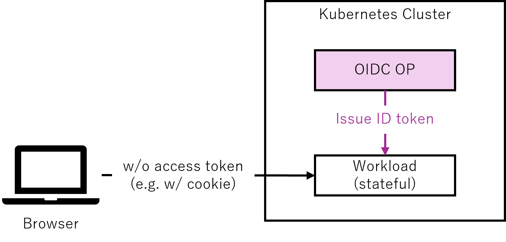
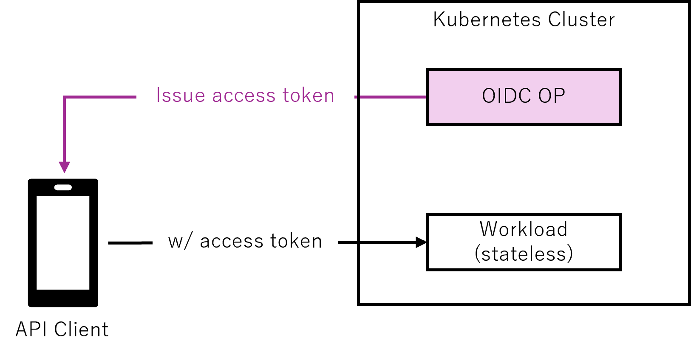
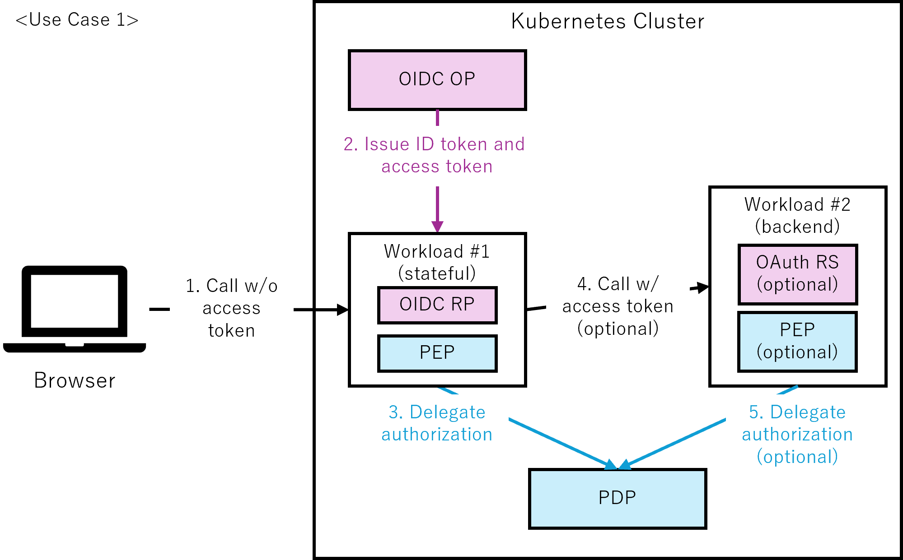
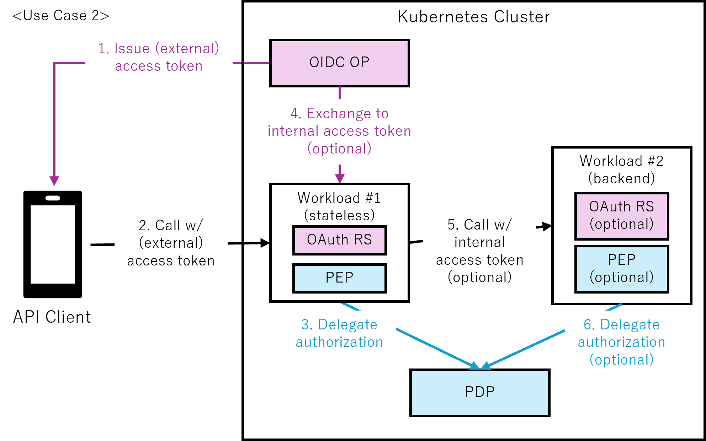
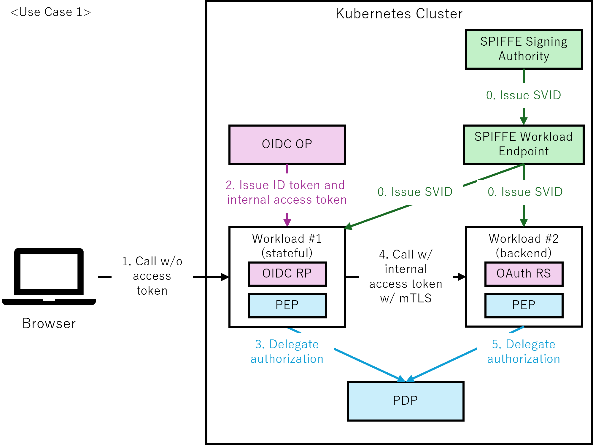
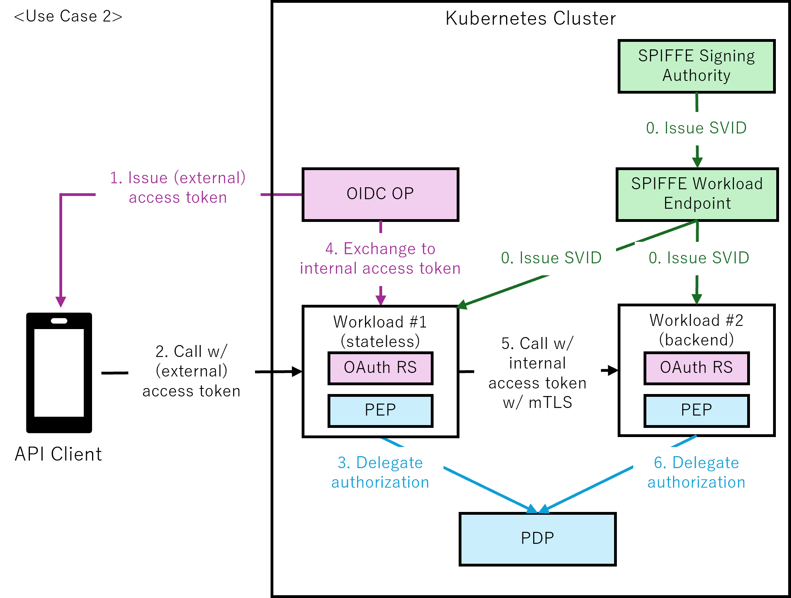

# Identity and Access Management Whitepaper
<!-- markdownlint-disable MD001 MD009 MD010 MD012 MD013 MD022 MD024 MD026 MD030 MD033 MD034 MD036 MD037 MD041 MD045 -->
<!-- cspell:disable -->
**Version**: 1.0 **Created**: 22 Mar 2026 **Status**: WIP | **In Review** | Approved

**Last Reviewed**: TBD, **PDF Published**: TBD **Release Version**: 1.0

**Final PDF Approvers** TBD

**Version 1 (Mar 2026)**

* **Contributors**: Yoshiyuki Tabata, Hiroyuki Wada, Satarupa Deb

* **Reviewers**: Takashi Norimatsu, Kyohei Mizumoto, Omri Gazitt, Maia Iyer, Yujia Lin, Eddie Knight, Evan Anderson, Brandt Keller, Jennifer Power, Justin Cappos, Marina Moore, John Kjell, Michael Lieberman, Jim Bugwadia, Andrew Block

<!-- cspell:enable -->

## Executive Summary

Controlling access to systems and data is a fundamental requirement in any environment; in cloud native environments, this requirement is shaped by characteristics such as highly dynamic and short-lived workloads, the collapse of perimeter-based trust models, and the need to integrate authentication and authorization into automated application lifecycles. Identity and Access Management (IAM) provides the foundation for this control, ensuring that only authenticated users and workloads can perform authorized actions.

This paper seeks to provide a straightforward technical guide for implementers in the form of two reference patterns for two use cases. It outlines best practices for applying authentication and authorization using widely adopted standards. It introduces two architectural patterns: one applies controls at the cluster boundary, and the other applies them at each workload. These patterns are designed to address differences in data sensitivity and network exposure.

Authentication requirements distinguish between human and workload identities, reflecting a key cloud native distinction. For human users, this includes the use of authorization code flow with PKCE[^1] (standards-based OAuth/OIDC authentication mechanisms) and multi-factor authentication aligned with AAL2[^2] or higher (NIST-defined authenticator assurance levels). For workloads, this includes service-to-service authentication mechanisms such as mutual TLS. Authorization requirements separate enforcement and decision logic, enabling observable, attribute- or relationship-based access control with consistent, centrally reasoned decisions across cloud native workloads.

These practices support consistent access control, regulatory compliance, and operational reliability across diverse cloud native deployments.

## 1\. Introduction

Authentication and authorization[^3] are some of the most important security considerations in the cloud native ecosystem, as evidenced by their high ranking in the OWASP Top 10[^4] and OWASP Top 10 API Security Risks[^5]. These processes ensure that only authenticated and authorized users or workloads can access resources and perform actions, thereby protecting sensitive data and maintaining system integrity and availability. However, implementing authentication and authorization can be challenging due to the wide range of related specifications, including OAuth 2.0 and OpenID Connect. Additionally, there are many implementations and architectural options available, each with different strengths and tradeoffs. As a result, selecting the appropriate approach can be challenging, particularly for practitioners who are new to authentication and authorization technologies. 

**Identity and Access Management** (IAM) is a framework for establishing who a user or system is and determining what they are permitted to do. In this white paper, the term “identity” explicitly includes both human identities and non‑human entities, such as workloads, services, and automated agents, which are treated as first‑class subjects in authentication and authorization decisions. IAM uses coordinated rules, procedures, and tools to govern authentication and authorization across systems and data. 

This white paper aims to provide a practical guide to help cloud native ecosystem architects and application developers understand and implement authentication and authorization effectively and securely through IAM, focusing on runtime access control patterns commonly used in cloud native systems.

### 1.1. Audience & Scope

This white paper is intended for cloud native ecosystem architects and application developers. It is also suitable for individuals at a beginner or novice level who may not yet be very familiar with identity and access management concepts and technologies. Additionally, to lower the barrier for beginners and novices, we have written technical terms in general terms whenever possible and included diagrams, figures, flowcharts, and references throughout the paper.

IAM is a broad term, so this white paper only describes how to achieve authentication and authorization in the cloud native ecosystem. It does not explain how to design identity providers (IdPs) or IAM products themselves, nor does it provide detailed implementation examples[^6]. While this paper focuses on practical guidance, it assumes that audiences are familiar with the basic distinction between authentication and authorization[^7].

To ensure clarity and practical relevance, this paper will concentrate exclusively on HTTP-based protocols such as REST APIs and gRPC, as well as synchronous request-response patterns. This paper also does not cover asynchronous, long-running processing, such as batch processing. Protocols that are not mentioned in this document include directory synchronization (e.g., SCIM), privileged access management (PAM), role engineering, on-premises access control systems, message protocols (e.g., AMQP, MQTT), agent-oriented or agent-to-agent interaction protocols or specifications (e.g., MCP, A2A)[^8], and legacy protocol support, such as raw TCP socket communication.

This paper focuses on system-level authorization evaluated at runtime using Policy Enforcement Points (PEPs) and Policy Decision Points (PDPs), and does not cover authorization policy management or user-managed authorization scenarios.

Regarding identity models, this paper adopts the W3C’s **federated identity model**[^9] as the basis for its authentication and authorization architecture give its prevalence in cloud native adopter environments which span on-premises, single-cloud, and multi-cloud deployments. This model offers a practical and scalable foundation for organizations adopting or modernizing cloud native systems. Other identity models include the **self-sovereign identity model[^10]** and the **centralized identity model**[^11], which are out of scope for this white paper.

The guidance and requirements described in this paper are intended to be applicable to both enterprise IAM (EIAM) and customer IAM (CIAM) scenarios. This includes authentication and authorization for internal users such as employees and partners, as well as external users such as customers and users of public-facing services.

### 1.2. Why is IAM Important?

IAM is essential for maintaining security and operations. It acts as a checkpoint to ensure that only authenticated and authorized users are granted access to various protected resources. By providing robust authentication and authorization, IAM helps organizations manage sensitive data and classified information. 

#### 1.2.1. IAM as a Foundation for Any System

At an organizational level, IAM works to restrict access to sensitive information to only authorized users and systems. As a result, the risk of data breaches is reduced. However, IAM must be properly implemented to deal with sophisticated cyber threats, as most failures arise from implementation issues, including misconfigurations or insufficient understanding of IAM concepts and technologies. At the same time, design weaknesses can also contribute to incidents, so systems should avoid patterns that are easy to misuse even when they are implemented as intended. 

Robust authentication protocols and access controls are crucial for counteracting insider threats, preventing unauthorized access, and protecting against credential theft. One of the most important security features of IAM is its ability to rapidly revoke access when users or systems must no longer be permitted to access resources, whether due to lifecycle events such as termination or deactivation, or due to security incidents such as account compromise. This helps eliminate potential security holes that could result from former users and decommissioned systems still having access rights. Complementary mechanisms such as just-in-time (JIT) access further reduce risk by minimizing the duration of granted privileges.

#### 1.2.2. Why IAM is Critical in Cloud Native Environments

1. Cloud native applications automatically scale up and down based on demand, with servers and containers constantly being created and destroyed-sometimes lasting only seconds. Traditional manual access approval cannot keep pace with this speed. Modern cloud native IAM automatically grants permissions when resources start and immediately revokes them when they shut down, ensuring security moves as fast as the infrastructure without creating gaps or requiring human intervention.  
2. Traditional IT relied heavily on perimeter-based defenses such as firewalls to protect data centers behind network walls. Cloud native applications are distributed across multiple clouds, regions, and devices, making this approach obsolete. IAM becomes the new security boundary through zero-trust principles-"never trust, always verify”. Every access request must prove its identity and authorization regardless of location, making identity verification the cornerstone of security rather than network boundaries.  
3. Cloud native applications consist of many microservices that communicate to complete tasks, similar to an online order passing through a website, payment, inventory, and delivery services. These services may be managed by different teams or hosted across different clouds. IAM enables secure workload-to-workload (service-to-service) communication through federated identity, short-lived tokens, and mutual authentication, maintaining security as requests hop across services without requiring each to manage separate authentication systems.  
4. Cloud native development treats infrastructure and security policies as code rather than manual configurations. IAM integrates into automated development pipelines, allowing security teams to define access policies as code that's version-controlled and automatically applied. This "shift-left" approach catches security issues before deployment-for example, preventing unintended cross-environment access when the same service is deployed across development, testing, and production environments. This prevents misconfigurations, ensures consistency, and maintains an audit trail while preserving the speed that cloud native development requires.

In cloud native environments, IAM must also address compliance and operational requirements that arise from highly distributed architectures. Multi‑cluster and multi‑cloud deployments require consistent auditability across environments, and short‑lived identities help reduce long‑term credential exposure. Automated policy enforcement ensures that least‑privilege access is maintained even as workloads scale dynamically or move across clusters. These capabilities allow organizations to maintain compliance and operational consistency without relying on manual processes that cannot keep pace with cloud native systems.

### 1.3. Applicable Standards

In the field of IAM, complying with standards is crucial, as in this field, there are mature, well reasoned standards which support the essential authentication and authorization features in a secure and trustworthy manner. Using standards supports interoperability and helps achieve secure integration across systems when correctly implemented.

The Relevance of Adhering to Standards:

**Security** – Adhering to established standards is crucial for minimizing vulnerabilities, preventing unauthorized access, and ensuring secure authentication and authorization, because they are designed and reviewed by leading security experts, validated by research institutions, widely implemented, and tested across diverse use cases.

**Ease of Integration** – Established standards ensure a wealth of interoperable IAM libraries and SDKs are available, reducing development effort and facilitating seamless integration with third-party services.

This white paper references the following standard specifications as best practices.

The key words “MUST”, “MUST NOT”, “REQUIRED”, “SHALL”, “SHALL NOT”, “SHOULD”, “SHOULD NOT”, “RECOMMENDED”, “MAY”, and “OPTIONAL” in this document are to be interpreted as described in RFC 2119 and RFC 8174 (BCP 14).

* **OAuth 2.0 (OAuth)**, defined in RFC 6749[^12] and RFC 6750[^13], is an industry-standard authorization framework for delegated access. It enables a client to obtain tokens to access a resource server on behalf of a resource owner (typically an end user) without sharing the resource owner's credentials with the client. The authorization decision about whether a user or a client can perform a specific action on a specific resource is made by the resource server or by an external policy decision point in accordance with applicable policy. OAuth conveys grants and constraints such as scope and audience. It does not define the authorization model itself. This white paper also references several related specifications that extend OAuth 2.0, including RFC 7636 (PKCE)[^14], RFC 7662 (Token Introspection)[^15], RFC 8414 (Authorization Server Metadata)[^16], RFC 8693 (Token Exchange)[^17], RFC 8705 (OAuth 2.0 Mutual-TLS)[^18], RFC 9449 (DPoP)[^19], and RFC 9700 (Best Current Practice for OAuth 2.0 Security)[^20], which together enhance its security, interoperability, and flexibility.  
* **OpenID Connect (OIDC)**, defined in OpenID Connect Core 1\.0[^21] by the OpenID Foundation, is the de facto standard authentication protocol. It adds an identity layer on top of OAuth 2.0, which itself does not provide authentication. In this white paper, we adopt only the authorization code flow with PKCE as the authentication flow for users, in alignment with current best practices defined by OIDC, RFC 9700, and FAPI[^22]. Other OAuth flows exist but are intended for different use cases and are therefore out of scope for the authentication model addressed here.  
* **NIST SP 800-162: Guide to Attribute Based Access Control (ABAC) Definition and Considerations[^23]** is a NIST guideline that defines the ABAC model and describes a P\*P architecture for making and enforcing authorization decisions. This white paper adopts only its architecture as a conceptual framework.  
* **Authorization API 1.0 (AuthZEN)[^24]**, developed by the OpenID Foundation Authorization Exchange (AuthZEN) Working Group, defines a standardized interface between PEPs and PDPs. It enables consistent, interoperable authorization decision requests and responses across distributed systems, and aligns well with the P\*P architecture defined in NIST SP 800-162.  
* **SPIFFE (Secure Production Identity Framework for Everyone)[^25]**, a Cloud Native Computing Foundation (CNCF) Graduated project, is a standard for enabling workloads to mutually authenticate using cryptographic identities.  
* **NIST SP 800-63: Digital Identity Guidelines**, specifically the Revision 4[^26], provides guidelines for digital identity management, including identity proofing, authentication, and federation. 

Standardization in authentication and authorization is an ongoing process. Current efforts, including Transaction Tokens[^27] by IETF Web Authorization Protocol (OAuth) Working Group and WIMSE Workload to Workload Authentication[^28] by IETF Workload Identity in multi-system Environments (WIMSE) Working Group, are part of continual improvement on top of a mature baseline.[^29]

### 1.4. Actors

This white paper assumes several types of actors commonly found in cloud native systems. These actors interact with the system in different ways and therefore require different authentication and authorization mechanisms.

| Actor | Description | Typical interaction |
| :---- | :---- | :---- |
| End user | External users such as customers | Participate in runtime authentication flows when accessing applications |
| Internal user | Internal users such as support or operations staff | Access applications or APIs that are not exposed to external users |
| Administrator | Users who manage policies or system configuration | Perform management and configuration tasks such as configuring identity federation, client registration, and authorization policies |
| Non-human actor | Workloads or devices | Interact with the system through service-to-service authentication and authorization mechanisms |

_Table 1: Actor definition and their interaction_

This distinction, particularly the increase in non-human and internal interactions, helps explain the threat models addressed by the basic and advanced patterns described later in this paper.

### 1.5. Privacy Principles

Authentication and authorization systems inevitably process information related to individuals and workloads. To minimize privacy risks and support compliance with regulations such as the General Data Protection Regulation (GDPR)[^30], this white paper adopts the following principles:

• Data minimization: Systems SHOULD avoid storing personally identifiable information (PII) unless strictly necessary. For example, the \`sub\` claim in OIDC and OAuth tokens SHOULD use opaque, non‑PII identifiers rather than user‑chosen login names or email addresses.

• Purpose limitation: Identity information SHOULD be used only for authentication, authorization, and auditing purposes directly related to the operation of the system.

• Right to erasure: When opaque identifiers are used, deleting the mapping between the identifier and the individual MAY support user deletion requests without requiring changes to downstream authorization systems.

• Secure handling of identity data: Token contents, logs, and policy inputs SHOULD be protected to prevent unauthorized disclosure of identity‑related information.

These principles do not replace formal privacy or regulatory requirements, but they provide practical guidance for designing authentication and authorization mechanisms that reduce unnecessary exposure of personal data.

## 2\. Reference Patterns

### 2.1. Use Cases

#### 2.1.1. Stateful Workload

This use case describes a stateful workload that manages the session. The workload delegates authentication to the OpenID Provider (OIDC OP), verifies the authentication result based on the issued ID token, and manages the session. The source of external access is assumed to be a user agent such as a browser, and it does not send an access token. Instead, the user agent sends a session identifier, such as a cookie, that the workload uses to look up and manage the server-side session. The user agent does not send workload information.

_Figure 1: Conceptual diagram of a stateful workload use case with session management_ 

#### 2.1.2. Stateless Workload

This use case describes a stateless workload that does not manage the session. The source of external access is assumed to be an API client, which sends an access token. The workload invoked acts as the API server.

_Figure 2: Conceptual diagram of a stateless workload use case with access tokens_

### 2.2. Components in the Reference Patterns

#### 2.2.1. OpenID Provider (OIDC OP)

OpenID Provider (OP) as defined in OIDC. It SHOULD have one logical instance in a Kubernetes cluster.

#### 2.2.2. Relying Party (OIDC RP)

Relying Party (RP) as defined in OIDC. Stateful workloads SHOULD incorporate RP functionality.

#### 2.2.3. Resource Server (OAuth RS)

Resource Server (RS) as defined in OAuth. In the basic pattern, stateless workloads SHOULD incorporate RS functionality, and backend workloads MAY incorporate RS functionality. In the advanced pattern, stateless workloads and backend workloads SHOULD incorporate RS functionality.

#### 2.2.4. SPIFFE Signing Authority

SPIFFE Signing Authority as defined in SPIFFE. It is an entity responsible for signing and issuing SPIFFE Verifiable Identity Documents (SVIDs) within a Trust Domain. In the advanced pattern, it SHOULD have one logical instance in a Kubernetes cluster.

#### 2.2.5. SPIFFE Workload Endpoint / SVID Delivery Mechanism

SPIFFE Workload Endpoint as defined in SPIFFE, or an alternative SVID delivery mechanism. The SPIFFE Workload Endpoint is a local endpoint that exposes the SPIFFE Workload API to workloads, enabling them to obtain SVIDs and trust bundles without pre-existing credentials. Alternative delivery mechanisms may be used depending on the implementation. In the advanced pattern, it SHOULD have an SVID delivery mechanism accessible to workloads on each Kubernetes node.

#### 2.2.6. Policy Enforcement Point (PEP)

Policy Enforcement Point (PEP) as defined in NIST SP 800‑162. In the basic pattern, workloads at the perimeter of the Kubernetes cluster SHOULD incorporate PEP functionality, and workloads that communicate only within the Kubernetes cluster MAY incorporate PEP functionality. In the advanced pattern, all workloads SHOULD incorporate PEP functionality.

#### 2.2.7. Policy Decision Point (PDP)

Policy Decision Point (PDP) as defined in NIST SP 800‑162. It SHOULD have one logical instance in a Kubernetes cluster. Note that this does not mean that a centralized policy engine is recommended and a distributed policy engine is not, but rather that one PDP functionality SHOULD exist within a Kubernetes cluster.

### 2.3. Overall Picture

When introducing authentication and authorization to satisfy the above use cases into the cloud native ecosystem, the security requirements vary greatly depending on the scale, budget, network configuration, sensitivity of the data handled, etc. To address these needs, we provide two patterns as the Overall Picture: the Basic Pattern and the Advanced Pattern.

Note that we are assuming one Kubernetes cluster and one trust domain here. Multi-cluster deployments and cross-trust domain federation are intentionally out of scope for this white paper, even though the presented patterns can be extended to support those architectures. In this white paper, a trust domain refers to the SPIFFE Trust Domain, which also serves as the trust boundary for OIDC and OAuth token issuance and validation.

#### 2.3.1. Rationale for Basic and Advanced Patterns

To effectively address the diverse security requirements of cloud native systems, this white paper introduces two architectural patterns: Basic and Advanced. These patterns are not merely technical configurations, but strategic models that reflect different levels of trust, exposure, and operational maturity.

The Basic Pattern provides a minimal security baseline suitable for systems with limited external exposure or sensitivity. It treats the Kubernetes cluster as a single implicit trust zone, applying authentication and authorization primarily at the perimeter. This makes it appropriate for environments handling non‑sensitive data or operating within restricted networks.

The Advanced Pattern adopts a zero-trust approach, treating each workload as its own trust boundary and protecting against internal threats such as lateral movement and privilege escalation. It SHOULD be used for systems handling sensitive data, public‑facing environments, or situations where the number of users is uncontrolled.

The following table summarizes the threat models and protection mechanisms associated with each pattern. This comparison helps clarify the rationale behind their design and guides practitioners in selecting the appropriate pattern based on their system’s risk profile and operational context.

| Pattern | Basic | Advanced |
| --- | --- | --- |
| **Threats Addressed** | External threats such as unauthorized access and impersonation at the perimeter. | External threats, and internal threats such as lateral movement and privilege escalation. |
| **Protection – TLS protection** | Mandatory at the perimeter | Mandatory for all components |
| **Protection – mTLS between workloads** | Not mandatory | Mandatory |
| **Protection – Multi-factor authentication** | Not mandatory | Mandatory |
| **Protection – Authorization code flow with PKCE** | Mandatory | Mandatory |
| **Protection – Access APIs with access tokens** | Mandatory for APIs at the perimeter | Mandatory for all APIs including internal APIs |
| **Protection – Access token validation** | Mandatory | Mandatory |
| **Protection – Delegation of authorization to PDP** | Mandatory at the perimeter | Mandatory for all workloads |

_Table 2: Basic and Advanced pattern threat models and security mechanisms_

#### 2.3.2. Basic Pattern

The Basic Pattern applies authentication and authorization at the boundary of the Kubernetes cluster.

This section focuses on the component structure and the end‑to‑end flows specific to the Basic Pattern.

_Figure 3-1: Basic pattern with perimeter-based authentication and authorization (use case 1\)_

1. **Call w/o access token:**  
   The browser sends a request to workload \#1 using a session identifier such as a cookie, without including an access token.  
2. **Issue ID token and access token:**  
   Workload \#1, acting as the OIDC RP, initiates the OIDC authorization code flow to request an ID token and an access token. The OIDC OP issues these tokens after successful authentication and user consent. Workload \#1 validates the issued ID token before the Delegate authorization step.  
3. **Delegate authorization:**  
   Workload \#1, acting as the PEP, sends the user identity (from the session, or access token) together with the requested resource and action to the PDP. The PDP returns an authorization decision, which workload \#1 enforces.  
4. **Call w/ access token (optional):**  
   Workload \#1 makes API calls to workload \#2. Adding the access token to the API call is optional. If the access token is included, workload \#2 acts as the OAuth RS and validates the access token.  
5. **Delegate authorization (optional):**  
   If the access token is included, workload \#2, acting as the PEP, sends the user identity (from the access token) together with the requested resource and action to the PDP. The PDP returns an authorization decision, which workload \#2 enforces.

_Figure 3-2: Basic pattern with perimeter-based authentication and authorization (use case 2\)_

1. **Issue (external) access token:**   
   The API client, acting as the OAuth client, initiates the OIDC authorization code flow to request an (external) access token. The OIDC OP issues the token after successful authentication and user consent.  
2. **Call w/ (external) access token:**   
   The API client sends a request to workload \#1 using the (external) access token. Workload \#1 acts as the OAuth RS and validates the (external) access token.  
3. **Delegate authorization:**   
   Workload \#1, acting as the PEP, sends the user identity (from the access token) together with the requested resource and action to the PDP. The PDP returns an authorization decision, which workload \#1 enforces.  
4. **Exchange to internal access token (optional):**   
   Workload \#1, acting as the OAuth RS, exchanges the (external) access token for an internal access token. Exchanging the (external) access token for an internal access token is optional.  
5. **Call w/ internal access token (optional):**   
   Workload \#1 makes API calls to workload \#2. Adding the internal access token to the API call is optional. If the internal access token is included, workload \#2 acts as the OAuth RS and validates the access token.  
6. **Delegate authorization (optional):**   
   If the internal access token is included, workload \#2, acting as the PEP, sends the user identity (from the access token) together with the requested resource and action to the PDP. The PDP returns an authorization decision, which workload \#2 enforces.

#### 2.3.3. Advanced Pattern

The Advanced Pattern enforces authentication and authorization at each workload following zero‑trust principles.

This section describes the component structure and the end‑to‑end flows specific to the Advanced Pattern.

_Figure 4-1: Advanced pattern with zero-trust architecture and workload authentication (use case 1\)_

0. **Issue SVID:**  
   The SPIFFE Signing Authority issues SVIDs, which are delivered to each workload through the SPIFFE Workload API exposed by the local SPIFFE Workload Endpoint. This enables mutual TLS (mTLS) authentication within the cluster.  
   The SVID establishes the workload identity of workload \#1 and workload \#2 via the mTLS connection. Note that the communication between the SPIFFE Signing Authority and the SPIFFE Workload Endpoint is implementation-specific and outside the scope of the SPIFFE specification.  
1. **Call w/o access token:**  
   The browser sends a request to workload \#1 using a session identifier such as a cookie, without including an access token.  
2. **Issue ID token and access token:**  
   Workload \#1, acting as the OIDC RP, initiates the OIDC authorization code flow to request an ID token and an access token. The OIDC OP issues these tokens after successful authentication and user consent. Workload \#1 validates the issued ID token before the Delegate authorization step.  
3. **Delegate authorization:**  
   Workload \#1, acting as the PEP, sends the user identity (from the session, or access token) together with the requested resource and action to the PDP. The PDP returns an authorization decision, which workload \#1 enforces.  
4. **Call w/ internal access token w/ mTLS:**  
   Workload \#1 makes API calls to workload \#2 using the internal access token and mTLS based on the SVID. Including the internal access token in the API call is mandatory. Workload \#2 acts as the OAuth RS and validates the internal access token.  
   In this pattern, workload identity is obtained from the SVID, while user identity and authorization context are carried in the internal access token.  
5. **Delegate authorization:**  
   Workload \#2, acting as the PEP, sends the user identity (from the access token) together with the requested resource and action to the PDP. The PDP returns an authorization decision, which workload \#2 enforces.

_Figure 4-2: Advanced pattern with zero-trust architecture and workload authentication (use case 2\)_

0. **Issue SVID:**  
   The SPIFFE Signing Authority issues SVIDs, which are delivered to each workload through the SPIFFE Workload API exposed by the local SPIFFE Workload Endpoint. This enables mutual TLS (mTLS) authentication within the cluster.  
   The SVID establishes the workload identity of workload \#1 and workload \#2 via the mTLS connection. Note that the communication between the SPIFFE Signing Authority and the SPIFFE Workload Endpoint is implementation-specific and outside the scope of the SPIFFE specification.  
1. **Issue (external) access token:**   
   The API client, acting as the OAuth client, initiates the OIDC authorization code flow to request an (external) access token. The OIDC OP issues the token after successful authentication and user consent.  
2. **Call w/ (external) access token:**   
   The API client sends a request to workload \#1 using the (external) access token. Workload \#1 acts as the OAuth RS and validates the (external) access token.  
3. **Delegate authorization:**   
   Workload \#1, acting as the PEP, sends the user identity (from the access token) together with the requested resource and action to the PDP. The PDP returns an authorization decision, which workload \#1 enforces.  
4. **Exchange to internal access token:**  
   Workload \#1, acting as the OAuth RS, exchanges the (external) access token for an internal access token.  
5. **Call w/ internal access token w/ mTLS:**  
   Workload \#1 makes API calls to workload \#2 using the internal access token and mTLS based on the SVID. Including the internal access token in the API call is mandatory. Workload \#2 acts as the OAuth RS and validates the internal access token.  
   In this pattern, workload identity is obtained from the SVID, while user identity and authorization context are carried in the internal access token.  
6. **Delegate authorization:**   
   Workload \#2, acting as the PEP, sends the user identity (from the access token) together with the requested resource and action to the PDP. The PDP returns an authorization decision, which workload \#2 enforces.

## 3\. Basic Pattern Requirements

### 3.1. Common Requirements

1. **MUST encrypt all communications outside of the Kubernetes cluster using TLS (Transport Layer Security).**  
   This is to ensure the confidentiality and integrity of data exchanged outside of the Kubernetes cluster, which is an implicit trust zone. TLS MUST use secure and up‑to‑date protocol versions and cipher suites in line with current industry best practices.

2. **SHOULD ensure that all components are redundant.**  
   This is to improve availability and prevent business outages due to an inability to allow access due to the component outage.

3. **MUST verify the identity of users through human interaction during authentication.**  
   This is to ensure robust user authentication. This step is crucial to confirm that users are who they claim to be, which helps prevent unauthorized access to important information and systems.

4. **SHOULD require multiple authentication factors.**  
   This is to ensure robust user authentication by combining different types of authentication factors, such as something you know (e.g., passwords, PINs), something you have (e.g., security tokens, smart cards), and something you are (e.g., biometrics). This approach enhances security by requiring multiple independent factors to verify a user's identity, making it more difficult for unauthorized individuals to gain access. The specific factors required SHOULD be determined by the applicable AAL, as defined in NIST SP 800-63B.

5. **MUST provide federated identity and assertion with security measures aligned to FAL2 or higher.**  
   This is to ensure secure identity federation between OIDC OP and OIDC RP with strong security guarantees. This requires digitally signed assertions, audience restriction to a single RP, and protection against injection attacks as defined in NIST SP 800-63C.

6. **MUST support only the authorization code flow for OIDC authentication.**  
   This is to ensure the highest level of security for authentication flows. The authorization code flow is the most secure OIDC flow as it keeps tokens away from the user agent (browser) and requires server-to-server communication for token issuance. Other flows, such as the implicit flow, expose tokens to the browser environment and are considered less secure, particularly in modern threat landscapes. Authorization codes MUST be short-lived (SHOULD be maximum 60 seconds for enhanced security contexts such as FAPI), single-use only, and cryptographically secure (generated using a CSPRNG with high entropy and resistance to prediction). The OIDC OP MUST invalidate authorization codes immediately after use and reject any subsequent attempts to use the same authorization code. If an authorization code reuse attempt is detected, the OIDC OP SHOULD treat it as a potential replay attack and revoke all tokens that were issued in response to that code.

7. **MUST use PKCE to strengthen the authorization code flow.**  
   This mitigates authorization code interception attacks by ensuring that only the original client can exchange the code for a token. Additionally, it can help reduce the risk of CSRF attacks by binding the authorization request to the client instance, with the protection occurring automatically on the OIDC OP side. This reduces the risk of CSRF vulnerabilities due to implementation errors on the OIDC RP/API Client (OAuth client) side. While parameters such as state or nonce provide complementary protection against CSRF or replay attacks, they do not replace PKCE. Therefore, PKCE MUST be used to provide robust and automated protection at the authorization code flow level. When using PKCE, clients MUST use the S256 code challenge method. The OIDC OP MUST enforce the use of the S256 code challenge method to prevent downgrade attacks.

8. **MUST implement authorization at the function level, the object level, and the object property level.**

   This is to address broken authorization at the function, object, and object property levels, which are highly rated in the OWASP Top 10 API Security Risks 2023\.

9. **MUST adopt the NIST SP 800‑162 P\*P architecture.**  
   This is to separate authorization logic from application logic, allowing for easier management and updates of authorization policies without affecting the core application functionality. And to provide a standardized architecture for authorization, enabling flexible technology selection by combining different technologies and tools.

### 3.2. Workload \#1 Requirements

#### 3.2.1. Common Workload \#1 Requirements

1. **MUST delegate authorization to PDP.**  
   This is to separate authorization logic from application logic and to enforce authorization.

2. **MUST log all requests.**  
   This is to enable investigation in the event of a security incident. Sensitive information, such as access tokens, MUST not be logged. The log MUST contain a unique identifier for each request (generate one if one does not exist) to allow for more efficient investigation. The log MUST also record the authorization decision applied to the request.

#### 3.2.2. Stateful Workload \#1 Requirements

1. **MUST act as a confidential client in the OIDC ecosystem and enable complete client authentication.**  
   This ensures secure and authenticated communication between the client and the OIDC provider.

2. **MUST validate ID tokens according to the OIDC specification.**  
   This ensures that the tokens are legitimate and have not been tampered with. Validation includes but is not limited to:

   1. Cryptographic verification (signature and, if applicable, decryption)

   2. Token provenance checks (issuer, audience, authorized party)

   3. Temporal validity (expiration, issuance time, authentication recency)

   4. Replay prevention (nonce verification)

   Implementers MUST follow the complete validation procedures defined in OIDC Core Section 3.1.3.7.

3. **MAY support interaction with OIDC discovery to obtain configuration metadata dynamically.**  
   This allows for automatic retrieval of OIDC provider metadata, reducing manual configuration errors.

4. **MUST ensure proper session management.**  
   This is to maintain secure user sessions and prevent unauthorized access through session-based attacks. Proper session management includes secure session creation, timeout handling (including max timeout and idle timeout), logout functionality, and protection against session fixation and hijacking attacks. Sessions are to be properly invalidated upon logout or expiration, and session identifiers SHOULD be cryptographically secure (generated using a CSPRNG with high entropy and resistance to prediction). When refresh tokens are available, the RP MAY handle refresh token revocation appropriately and invalidate sessions accordingly when refresh token usage fails.

5. **MAY access the UserInfo endpoint to obtain updated user information.**  
   This allows OIDC RP to retrieve current user information from the OIDC OP using valid access tokens. This is useful for applications that need to reflect changes in user attributes (such as roles, permissions, or profile information) during an active session without requiring re-authentication.

6. **MAY use received access tokens for subsequent workload calls.**  
   This allows OIDC RP to use access tokens received from the OIDC OP for calling downstream workloads on behalf of the authenticated user.

#### 3.2.3. Stateless Workload \#1 Requirements

1. **MUST perform client authentication to OIDC OP with a client ID and client secret.**  
   This is to ensure that only registered workloads can access OIDC OP. Note that OAuth RS performs client authentication during token introspection and token exchange. Note that you MAY use stronger client authentication methods, such as private\_key\_jwt using an asymmetric key pair or tls\_client\_auth/self\_signed\_tls\_client\_auth using a client certificate rather than client\_secret\_post using a client ID and client secret, based on the workload's security requirements.

2. **MUST validate external access tokens.**  
   This is to ensure that tokens are legitimate and have not been tampered with. Note that it does not matter whether access tokens are handle-based or assertion-based. Note that in the case of handle-based, OAuth RS MUST obtain the access token metadata through the OIDC OP's introspection endpoint. The validation includes:

   1. Signature: Verify that the token has not been tampered with if it is assertion-based.

   2. Duration: Verify that the token is within its duration (it has started and has not expired).

   3. Issuer: Verify that the token has been issued by legitimate OIDC OPs.

   4. Audience: Verify that the token is intended for the OAuth RS that received it.

   5. Subject: Verify that the token’s subject identifies a currently active principal in the correct trust domain for this OAuth RS.

   6. Revocation: Verify that the token has not been revoked. Note that OAuth RS MAY cache revoked tokens for the duration of the tokens' expiration to improve performance.

   Note that scope validation is classified as authorization, so this is not included here. Authorization is decided by the PDP, as described in the Authorization Requirements section below.

3. **MAY exchange external access tokens for internal access tokens.**  
   This is to prevent private information from being leaked from external access tokens by removing sensitive information such as Personally Identifiable Information (PII) from external access tokens and including sensitive information only in internal access tokens. Also, this is to propagate user identity and workload identity to subsequent workloads with internal access tokens for using them in their application logic. Note that rather than exchanging the external access token for an internal access token, you MAY instead propagate the external access token to subsequent workloads as is, or you MAY propagate user and workload identities in a form other than the internal access token.

### 3.3. Workload \#2 Requirements

1. **MUST log all requests.**  
   This is to enable investigation in the event of a security incident. Sensitive information, such as access tokens, MUST not be logged. The log MUST contain a unique identifier for each request (generate one if one does not exist) to allow for more efficient investigation. The log MUST also record the authorization decision applied to the request.

2. **MUST perform client authentication to OIDC OP with a client ID and client secret.**  
   This is to ensure that only registered workloads can access OIDC OP. Note that OAuth RS performs client authentication during token introspection and token exchange. Note that you MAY use stronger client authentication methods, such as private\_key\_jwt using an asymmetric key pair or tls\_client\_auth/self\_signed\_tls\_client\_auth using a client certificate rather than client\_secret\_post using a client ID and client secret, based on the workload's security requirements.

3. **MAY validate internal access tokens.**  
   This is to ensure that tokens are legitimate and have not been tampered with. Note that this MUST be done when the workload receives an internal access token. Note that it does not matter whether access tokens are handle-based or assertion-based. Note that in the case of handle-based, OAuth RS MUST obtain the access token metadata through the OIDC OP's introspection endpoint. The validation includes:

   1. Signature: Verify that the token has not been tampered with if it is assertion-based.

   2. Duration: Verify that the token is within its duration (it has started and has not expired).

   3. Issuer: Verify that the token has been issued by legitimate OIDC OPs.

   4. Audience: Verify that the token is intended for the OAuth RS that received it.

   5. Subject: Verify that the token’s subject identifies a currently active principal in the correct trust domain for this OAuth RS.

   6. Revocation: Verify that the token has not been revoked. Note that OAuth RS MAY cache revoked tokens for the duration of the tokens' expiration to improve performance.

   Note that scope validation is classified as authorization, so it is not included here. Authorization is decided by the PDP, as described in the Authorization Requirements section below.

4. **MAY exchange internal access tokens for internal access tokens.**  
   This is to propagate user identity and workload identity to subsequent workloads with internal access tokens for using them in their application logic. Note that rather than exchanging the original internal access token for a new internal access token, for example using OAuth 2.0 Token Exchange (RFC 8693), you MAY propagate the original internal access token to subsequent workloads as is, or you MAY propagate user and workload identities in a form other than the internal access token.

5. **MAY delegate authorization to PDP.**  
   This is to separate application logic from authorization logic. Note that in the basic pattern, not all workloads require authorization, and you MAY enforce authorization only if you want.

### 3.4. OIDC OP Requirements

1. **MUST ensure that only one logical OIDC OP exists within a single trust domain.**  
   This is to maintain a clear and consistent authentication authority within the system, simplifying authentication management and improving security.

2. **MUST support authentication methods appropriate to the applicable AAL.**  
   This is to ensure authentication security matches the required assurance level. For AAL1, single-factor authentication (such as passwords) is acceptable. For AAL2 and above, multi-factor authentication MUST be used, incorporating methods such as Passkeys (FIDO2) and TOTP. SMS verification MAY be used as a second factor. Organizations SHOULD consider the security implications of SMS in their specific operational context, particularly regarding SIM swap attack risks which vary by region and carrier security practices.

3. **MUST ensure proper session management.**  
   This is to maintain secure user sessions and prevent unauthorized access through session-based attacks. Proper session management includes secure session creation, timeout handling (including max timeout and idle timeout), logout functionality, and protection against session fixation and hijacking attacks. Sessions SHOULD be properly invalidated upon logout or expiration, and session identifiers to be cryptographically secure (generated using a CSPRNG with high entropy and resistance to prediction).

4. **MUST ensure secure issuance and management of tokens.**  
   This is to protect against token-based security vulnerabilities during token creation and lifecycle management. Token security requirements vary by type:

   1. ID Token: MUST be properly signed using cryptographic algorithms (e.g., RS256 for standard implementations, PS256 or ES256 for enhanced security contexts such as FAPI), include appropriate claims (iss, aud, exp, iat, sub), and set reasonable expiration times.

   2. Access Token: MUST have the shortest practical lifetime necessary for the use case to minimize the window of exposure if compromised. For assertion-based tokens (JWT), MUST be signed and include necessary claims and minimal scope. For handle-based tokens (opaque tokens), MUST securely store the associated token metadata and provide introspection endpoints that allow resource servers to validate tokens and retrieve their metadata. Revocation capability MAY be supported, but it is generally unnecessary because short‑lived access tokens naturally limit exposure.

   3. Refresh Token: MUST be securely managed with proper lifecycle controls and revocation capabilities.

   Additionally, signing keys MUST be securely managed with appropriate protection, access controls, and regular rotation policies.

5. **MUST provide required OIDC endpoints and support OIDC Discovery.**  
   This includes providing the Authorization Endpoint, Token Endpoint, and UserInfo Endpoint as defined in the OIDC specification. When optional features are supported, the OP MUST expose the corresponding endpoints defined by the relevant standards (e.g., OIDC logout, RFC 7009 token revocation, RFC 7662 token introspection). The OP MUST support OIDC Discovery to publish configuration metadata.

6. **MAY support dynamic client registration while ensuring secure management of client credentials.**  
   This is to support use cases, such as mobile application instances, registering for installation-specific credentials. In this case, each installed instance registers dynamically to obtain a unique client ID and appropriate authentication credentials. The specific authentication method (client secret, OAuth 2.0 Mutual-TLS, or private\_key\_jwt) SHOULD be chosen based on the application's security requirements. For example, enhanced security contexts, such as FAPI, require OAuth 2.0 Mutual-TLS or private\_key\_jwt. This prevents hardcoded credentials from being extracted and allows the app to be treated as a confidential client.

7. **MAY support sender-constrained tokens for access and refresh tokens**

   Access tokens and refresh tokens can be bound to the client using DPoP or OAuth 2.0 Mutual-TLS to prevent unauthorized or illegitimate parties from using leaked or stolen tokens.

### 3.5. PDP Requirements

1. **MUST not be accessible at the network level from outside the Kubernetes cluster.**  
   This is to eliminate the attack surface for attacks that could affect authorization decisions.

2. **MUST log all authorization decisions along with their input.**  
   This is to enable investigation in the event of a security incident. Note that sensitive information such as Personally Identifiable Information (PII) MUST not be logged. Note that the log SHOULD contain the unique identifier from the PEP to allow for more efficient investigation.

3. **SHOULD provide standardized APIs to PEPs.**

   This is to maintain interoperability between PEPs and PDP, and PDP SHOULD expose PEP–PDP interfaces aligned with Authorization API 1.0.

4. **SHOULD** **adopt ABAC (Attribute-Based Access Control) or ReBAC (Relationship-Based Access Control) as the authorization model.**  
   This is to implement fine-grained authorization at the function, object, and object property levels. Note that implementing fine-grained authorization with RBAC is difficult and MAY result in role explosion.  
   When selecting between ABAC and ReBAC, consider the following:

   1. ABAC is well-suited when authorization decisions depend primarily on attributes of subjects, resources, actions, and environmental context (e.g., time of day, location, risk score, classification level).

   2. ReBAC is well-suited when authorization decisions depend primarily on relationships between entities (e.g., ownership, organizational hierarchy, group membership, document sharing). 

   Note that these models are not mutually exclusive. Some implementations combine relationship-based and attribute-based conditions within a single policy framework.

5. **MAY cache policies and information.**

   This is to improve performance. Note that in highly sensitive environments, you SHOULD consider disabling caching entirely or tightly constraining it to reduce the risk of stale cached information.

6. **MAY cache authorization decisions.**

   This is to improve performance. Note that in highly sensitive environments, you SHOULD consider disabling caching entirely or tightly constraining it to reduce the risk of stale cached information.

## 4\. Advanced Pattern Requirements

### 4.1. Common Requirements

1. **MUST encrypt all communications between all components using TLS (Transport Layer Security).**

   This is to ensure the confidentiality and integrity of data exchanged between each component, which is an implicit trust zone.

2. **MUST require multiple authentication factors.**  
   This is to ensure protection against password-based attacks and credential theft. All authentication flows MUST enforce AAL2 as minimum, prohibiting AAL1.

### 4.2. Workload \#1 Requirements

#### 4.2.1. Common Workload \#1 Requirements

There are no requirements in addition to those for the Basic Pattern.

#### 4.2.2. Stateful Workload \#1 Requirements

1. **MUST perform client authentication to OIDC OP with an SVID.**  
   This is to ensure that only registered workloads can access OIDC OP. Note that OIDC RP performs client authentication during authorization code flow. Note that in the advanced pattern, the SPIFFE Signing Authority issues an SVID, and the OIDC RP performs client authentication using the SVID. Note that the SVID MUST be in the form of an X.509 certificate or a JWT token.

2. **MUST encrypt sensitive session state when stored.**  
   This is to reduce the risk of token leakage and unauthorized access in the event of storage compromise. Session state that includes authentication context or tokens MUST be encrypted at rest using appropriate mechanisms.

#### 4.2.3. Stateless Workload \#1 Requirements

1. **MUST perform client authentication to OIDC OP with an SVID.**  
   This is to ensure that only registered workloads can access OIDC OP. Note that OAuth RS performs client authentication during token introspection and token exchange. Note that in the advanced pattern, the SPIFFE Signing Authority issues an SVID, and the OAuth RS performs client authentication using the SVID. Note that the SVID MUST be in the form of an X.509 certificate or a JWT token.

2. **MUST encrypt sensitive information, such as Personally Identifiable Information (PII) when stored.**  
   This is to reduce the risk of unauthorized or unintended disclosure of sensitive information due to attacks, misconfigurations, or operational errors.

3. **SHOULD exchange external access tokens for internal access tokens.**  
   This is to prevent private information from being leaked from external access tokens by removing sensitive information such as Personally Identifiable Information (PII) from external access tokens and including sensitive information only in internal access tokens. Also, this is to propagate user identity and workload identity to subsequent workloads with internal access tokens for use in their application logic. Note that rather than exchanging the external access token for an internal access token, you MAY propagate the external access token to subsequent workloads as is.

### 4.3. Workload \#2 Requirements

1. **MUST perform client authentication to OIDC OP with an SVID.**  
   This is to ensure that only registered workloads can access OIDC OP. Note that OAuth RS performs client authentication during token introspection and token exchange. Note that in the advanced pattern, the SPIFFE Signing Authority issues an SVID, and the OAuth RS performs client authentication using the SVID. Note that the SVID MUST be in the form of an X.509 certificate or a JWT token.

2. **MUST encrypt sensitive information, such as Personally Identifiable Information (PII) when stored.**  
   This is to reduce the risk of unauthorized or unintended disclosure of sensitive information due to attacks, misconfigurations, or operational errors.

3. **MUST validate internal access tokens.**  
   This is to ensure that tokens are legitimate and have not been tampered with. Note that it does not matter whether access tokens are handle-based or assertion-based. Note that in the case of handle-based, OAuth RS MUST obtain the access token metadata through the OIDC OP's introspection endpoint. The validation includes:

   1. Signature: Verify that the token has not been tampered with if it is assertion-based.

   2. Duration: Verify that the token is within its duration (it has started and has not expired).

   3. Issuer: Verify that the token has been issued by legitimate OIDC OPs.

   4. Audience: Verify that the token is intended for the OAuth RS that received it.

   5. Subject: Verify that the token’s subject identifies a currently active principal in the correct trust domain for this OAuth RS.

   6. Revocation: Verify that the token has not been revoked. Note that OAuth RS MAY cache revoked tokens for the duration of the tokens' expiration to improve performance.

   Note that scope validation is classified as authorization, so this is not included here. Authorization is decided by the PDP, as described in the Authorization Requirements section below.

4. **SHOULD exchange internal access tokens for internal access tokens.**  
   This is to propagate user identity and workload identity to subsequent workloads with internal access tokens for using them in their application logic. Note that rather than exchanging the original internal access token for a new internal access token, for example using OAuth 2.0 Token Exchange (RFC 8693), you MAY propagate the original internal access token to subsequent workloads as is.

5. **MUST delegate authorization to PDP.**  
   This is to separate authorization logic from application logic and to enforce authorization.

### 4.4. OIDC OP Requirements

There are no requirements in addition to those for the Basic Pattern.

### 4.5. PDP Requirements

1. **MUST encrypt sensitive information, such as Personally Identifiable Information (PII) when stored.**  
   This is to reduce the risk of unauthorized or unintended disclosure of sensitive information due to attacks, misconfigurations, or operational errors.

2. **MUST authenticate the PEP using an SVID.**

   This is to minimize the implicit trust zone and to make authentication mandatory between PEP and PDP, just like any other workload, following the zero-trust network architecture concept. This also enables the PDP to apply authorization policies based on workload identity in addition to user identity, supporting dual-subject authorization in the advanced pattern.

### 4.6. SPIFFE Signing Authority Requirements

Note that the SPIFFE specification does not define the relationship between the SPIFFE Signing Authority and the SPIFFE Workload Endpoint. They MAY be implemented as a single integrated component or as separate components. When using alternative SVID delivery mechanisms instead of the SPIFFE Workload Endpoint, the following requirements apply to those mechanisms accordingly. The following requirements include both SPIFFE specification-based requirements and IAM best practices recommended by this whitepaper.

1. **MUST ensure that a SPIFFE Signing Authority exists within each trust domain.**  
   This is to provide a clear and consistent authority for issuing SVIDs and establishing the trust anchors used for SVID validation within the trust boundary.

2. **MUST issue and manage SVIDs within the trust domain.**  
   This is to provide SVIDs in accordance with the SPIFFE specification. The SPIFFE Signing Authority is responsible for creating, signing, and distributing SVIDs within its trust domain.

3. **(When deployed separately from SPIFFE Workload Endpoint) MUST identify SPIFFE Workload Endpoint before allowing access to SVIDs.**  
   This is to prevent unidentified entities from retrieving SVIDs and impersonating workloads. The SPIFFE Signing Authority MUST verify the identity of SPIFFE Workload Endpoints through appropriate identification mechanisms before granting access to SVID issuance functionality.

4. **MUST manage and distribute trust bundles.**  
   This is to enable workloads to verify the authenticity of SVIDs presented by other workloads. The SPIFFE Signing Authority MUST maintain and provide trust bundles containing the public key material necessary for SVID validation within the trust domain.

5. **MUST manage cryptographic keys securely and implement automated SVID rotation.**  
   This is to minimize the risk of credential compromise by reducing the lifespan of SVIDs. The SPIFFE Signing Authority is responsible for initiating SVID rotation and distributing updated SVIDs to SPIFFE Workload Endpoints through implementation-specific distribution mechanisms. Secure key management ensures that trust domain root keys and SVID signing keys are protected from unauthorized access. The lifespan of trust domain root keys SHOULD be minimized to reduce their exposure to potential compromise.

6. **(When deployed separately from SPIFFE Workload Endpoint) MAY implement attestation-based issuance mechanisms.**  
   This is to ensure that only legitimate SPIFFE Workload Endpoints receive SVIDs. While the specific identification methods are implementation-specific and not defined by the SPIFFE specification, the SPIFFE Signing Authority MAY validate SPIFFE Workload Endpoint identity and trustworthiness through various mechanisms such as platform-specific attestation, pre-shared join tokens, or other implementation-specific identification methods before issuing SVIDs.

### 4.7. SPIFFE Workload Endpoint / SVID Delivery Mechanism Requirements

Note that the SPIFFE specification does not define the relationship between the SPIFFE Signing Authority and the SPIFFE Workload Endpoint. They MAY be implemented as a single integrated component or as separate components. When using alternative SVID delivery mechanisms instead of the SPIFFE Workload Endpoint, the following requirements apply to those mechanisms accordingly. The following requirements include both SPIFFE specification-based requirements and IAM best practices recommended by this whitepaper.

1. **(When deployed separately from SPIFFE Signing Authority) MUST retrieve SVIDs from the SPIFFE Signing Authority.**  
   This is to enable workload identity distribution as required by the SPIFFE Workload Endpoint's role as an intermediary between workloads and the SPIFFE Signing Authority. The SPIFFE Workload Endpoint MUST be capable of obtaining SVIDs on behalf of workloads.

2. **(When deployed separately from SPIFFE Signing Authority) MAY cache SVIDs locally for performance optimization.**  
   This is to improve response times for SVID requests and reduce load on the SPIFFE Signing Authority.

3. **MUST implement secure workload identity delivery mechanisms.**  
   This is to ensure that SVIDs are delivered only to legitimate workloads as intended by the SPIFFE Signing Authority. The SPIFFE Workload Endpoint MUST verify workload identity through platform-specific mechanisms before providing access to SVIDs. The delivery mechanism MAY use the SPIFFE Workload API, Kubernetes Secrets, Envoy SDS, or other implementation-specific methods.

4. **(When deployed separately from SPIFFE Signing Authority) MUST use secure communication with the SPIFFE Signing Authority.**  
   This is to protect workload identity requests and responses from interception or tampering. Communication security varies depending on the phase. During initial bootstrap, the SPIFFE Workload Endpoint MUST use implementation-specific identification mechanisms such as platform-specific attestation, pre-shared join tokens, or other secure bootstrapping methods (as mTLS is not possible without an existing SVID). After obtaining an initial SVID, the SPIFFE Workload Endpoint MUST use mTLS for subsequent communications with the SPIFFE Signing Authority to provide mutual authentication and prevent spoofing.

5. **(When deployed separately from SPIFFE Signing Authority) MUST handle SVID rotation updates from the SPIFFE Signing Authority.**  
   This is to maintain current workload identities by receiving and processing updated SVIDs distributed by the SPIFFE Signing Authority through implementation-specific distribution mechanisms. The SPIFFE Workload Endpoint MUST process updated SVIDs and notify workloads of identity changes through appropriate delivery methods. If caching is implemented, the SPIFFE Workload Endpoint MUST update cached SVIDs accordingly.

6. **MUST retrieve and distribute trust bundles to workloads.**  
   This is to enable workloads to verify SVIDs presented by other workloads. The SPIFFE Workload Endpoint MUST obtain trust bundles from the SPIFFE Signing Authority and make them available to workloads through the same delivery mechanisms used for SVIDs.

7. **MAY support flexible workload identification mechanisms.**  
   This is to accommodate different deployment environments and security requirements, allowing organizations to choose workload identification methods that best suit their infrastructure and platform characteristics during the pre-SVID issuance phase.

## Conclusion

Authentication and authorization are fundamental to ensure security in the cloud native ecosystem. Their importance is evident from the fact that security risks related to authentication and authorization top the OWASP Top 10 and OWASP Top 10 API Security Risks. To protect sensitive data and maintain the integrity of the system, only authenticated and authorized users or workloads can access resources.

This white paper presents best practices for implementing authentication and authorization effectively and securely based on standards such as OIDC, OAuth, NIST SP 800‑162, Authorization API 1.0, SPIFFE, and NIST SP 800-63, and presents authentication and authorization requirements for both stateful and stateless workloads in two patterns: basic and advanced.

## Appendix

### Resources

**Beginner (start here):**

1. **Microsoft Learn \- Identity and Access Management (IAM): Core Concepts**  
    [https://learn.microsoft.com/en-us/entra/fundamentals/identity-fundamental-concepts](https://learn.microsoft.com/en-us/entra/fundamentals/identity-fundamental-concepts)

2. **Auth0 \- Cloud Identity and Access Management Guide**  
    [https://auth0.com/learn/cloud-identity-access-management](https://auth0.com/learn/cloud-identity-access-management)

### Glossary

**Identity Provider (IdP)**

An entity that performs identity verification and issues authentication assertions or tokens to Relying Parties (RPs). In federated identity models, the IdP is responsible for authenticating users and providing identity information in a secure and standardized format, such as SAML assertions or OpenID Connect ID tokens.

**Federated Identity Model**

A model in which multiple services rely on one or more trusted IdPs. This model allows authentication to be delegated to IdPs, enabling centralized user authentication across services while reducing the need for each service to manage user credentials independently.

**Self-Sovereign Identity Model (Decentralized Identity Model)**

A decentralized identity model in which users fully control their own digital identities without relying on a central authority. While this model offers strong privacy and user autonomy, it is still emerging and not yet widely adopted in production environments.

**Centralized Identity Model (Siloed / Traditional Identity Model)**

A model in which each service independently manages its own user identities and credentials without relying on a shared IdP. This siloed approach often results in fragmented identity management, inconsistent access control, and a poor user experience due to the lack of SSO.

**Single Sign-On (SSO)**

An authentication mechanism that allows a user to access multiple independent systems or services with a single login session, typically implemented via federated identity protocols.

**Resource Owner (RO)**

A role defined in OAuth 2.0. An entity that can grant access to a protected resource.

**Resource Server (RS)**

A role defined in OAuth 2.0. A server that hosts protected resources and can accept and respond to requests to protected resources using access tokens.

**Client**

A role defined in OAuth 2.0. An application that requests protected resources on behalf of, and with the authorization of, a resource owner. There are confidential clients, such as web applications, which can securely manage their own authentication credentials, and public clients, such as single-page applications, which cannot.

**Authorization Server (AS)**

A role defined in OAuth 2.0. A server issues an access token to the client upon successful authentication and authorization of the resource owner.

**Access token**

A credential used to access protected resources. It represents the grant's scope, duration, issuer, audience, and other attributes. It either denotes an identifier used to retrieve authorization information (called handle-based token, e.g., random alphanumeric characters) or contains authorization information in itself (called assertion-based token, e.g., JSON Web Token (JWT)).

**Refresh token**

A credential used to obtain a new access token if the current access token becomes invalid or expires.

**Authorization code flow**

An authorization flow defined in OAuth 2.0. A flow for a client to obtain a resource owner's authorization to request an access token.

**RFC 7636 (Proof Key for Code Exchange by OAuth Public Clients)**

An OAuth extension that mitigates attacks such as Authorization Code Injection and Cross-Site Request Forgery (CSRF) and makes the authorization code flow more secure. It is called PKCE.

**RFC 7662 (OAuth 2.0 Token Introspection)**

An OAuth extension that enables a resource server to fetch metadata like validity and scope of access token and attribute information of the resource owner and client.

**RFC 8414 (OAuth 2.0 Authorization Server Metadata)**

An OAuth extension that defines the information available for clients from a discovery endpoint, including supported OAuth endpoints, scopes, and other capabilities of the authorization server.

**RFC 8693 (OAuth 2.0 Token Exchange)**

An OAuth extension that allows for the exchange of one token for another, such as when a resource server accesses other resource servers on behalf of the resource owner.

**RFC 8705 (OAuth 2.0 Mutual-TLS Client Authentication and Certificate-Bound Access Tokens)**

An OAuth extension that defines client authentication using mutual TLS and introduces certificate-bound access and refresh tokens. These tokens are sender-constrained, meaning they can only be used by the client presenting the correct X.509 certificate. It is called OAuth 2.0 Mutual-TLS.

**RFC 9449 (OAuth 2.0 Demonstration of Proof of Possession)**

An OAuth extension that binds an access token or refresh token to a cryptographic key controlled by the client. These tokens are sender-constrained, requiring proof that the client possesses the private key associated with the token. It is called DPoP.

**End-User**

A role defined in OIDC. An OAuth Resource Owner who is authenticated by the OpenID Provider.

**OpenID Provider (OP)**

A role defined in OIDC. An OAuth Authorization Server that is capable of authenticating the End-User and providing information to a Relying Party about the authentication result and the End-User.

**Relying Party (RP)**

A role defined in OIDC. An OAuth Client requiring End-User authentication and information from an OpenID Provider.

**ID token**

A credential contains information about the authentication result and the End-User, and is represented as a JWT.

**Policy Decision Point (PDP)**

A role defined in the P\*P architecture. A system entity that evaluates applicable policies and makes authorization decisions.

**Policy Enforcement Point (PEP)**

A role defined in the P\*P architecture. A system entity that performs access control by making decision requests and enforcing authorization decisions.

**Policy Information Point (PIP)**

A role defined in the P\*P architecture. A system entity that serves as a source of attribute values.

**Policy Administration Point (PAP)**

A role defined in the P\*P architecture. A system entity that creates a policy or policy set.

**SPIFFE ID**

A unique identifier for each workload defined in SPIFFE.

**SVID (SPIFFE Verifiable Identity Document)**

A document containing a SPIFFE ID, that is used to mutually authenticate. SVIDs come in two formats: X.509 certificates (X.509-SVID) and JWT tokens (JWT-SVID).

**Trust Domain**

A root of trust for a SPIFFE infrastructure. It represents a security boundary where a single authority is responsible for issuing and managing identities. A trust domain can correspond to organizations, environments, departments, or any logical grouping that requires independent identity management. All workloads within a trust domain receive SVIDs that are verifiable using the trust domain's root keys. Every SPIFFE ID begins with the trust domain name (e.g., spiffe://example.org/service), establishing the trust root and identity namespace for that workload.

**Trust Bundle**

A set of public key material used to verify SVIDs issued within that trust domain. This contains the necessary cryptographic material for validating both X.509 and JWT SVIDs, and is represented as an RFC 7517 compliant JWK Set, providing a flexible format for representing various types of cryptographic keys and enabling wide interoperability support. Trust bundles are primarily used by workloads within the same trust domain to validate each other's identities. Additionally, trust bundles can enable cross-trust domain authentication by allowing workloads from different trust domains to validate each other's identities when configured appropriately.

**SPIFFE Workload API**

An API that allows workloads to securely obtain their SVIDs and trust bundles without requiring the workload to have knowledge of its own identity or possess authentication tokens.

**SPIFFE Signing Authority**

A service responsible for issuing and rotating SVIDs within a trust domain.

**SPIFFE Workload Endpoint**

A local endpoint that exposes the SPIFFE Workload API to workloads, enabling them to obtain SVIDs and trust bundles. The endpoint verifies workload identity through out-of-band mechanisms without requiring the workload to actively participate in authentication.

**Attestation-based Issuance**

An identity issuance approach where SVIDs are issued only after proper identification and verification processes.

**IAL (Identity Assurance Level)**

The level defined in NIST SP 800-63 that describes the confidence with which an individual’s claimed identity can be verified, based on the strength of the identity proofing process and the evidence provided.

**AAL (Authenticator Assurance Level)**

The level defined in NIST SP 800-63 that describes how securely a user authenticates to a system, based on the type and robustness of authenticators used, such as single-factor, multi-factor, or hardware-based cryptographic authenticators.

**FAL (Federation Assurance Level)**

The level defined in NIST SP 800-63 that describes how securely identity information is shared across systems, based on the protection mechanisms applied to federated assertions, including audience restriction, replay protection, and client authentication.

**SAML 2.0 (Security Assertion Markup Language)**

An XML-based standard for exchanging authentication and authorization data between IdPs and SPs, enabling SSO across different domains.

**User Identity**

A digital representation of a user, including identifying information, authentication credentials, and associated attributes that define a user's digital presence.

**Workload Identity**

A digital representation of a workload, including identifying information, authentication credentials, and associated attributes that define a workload’s digital presence.

**FAPI (Financial-grade API)**

A set of security profiles developed by the OpenID Foundation to strengthen OAuth and OIDC for high-security API environments. FAPI introduces formally verified requirements for authorization flows, including such as PKCE. It is designed to mitigate threats such as token leakage and replay attacks.

**ABAC (Attribute-Based Access Control)**

An authorization model that decides authorization based on attributes of users, resources, and environmental conditions.

**ReBAC (Relationship-Based Access Control)**

An authorization model that decides authorization based on the relationships between entities in a system.

### References & Citations

1. Campbell, Brian, and Michael B. Jones. 2020\. “RFC 8705 \- Mutual TLS Profile for OAuth 2.0.” IETF Datatracker. [https://datatracker.ietf.org/doc/html/rfc8705](https://datatracker.ietf.org/doc/html/rfc8705).  
2. Campbell, Brian, Joe A. Salowey, Arndt Schwenkschuster, and Yaron Sheffer. 2025\. “WIMSE Workload to Workload Authentication.” IETF Datatracker. [https://datatracker.ietf.org/doc/draft-ietf-wimse-s2s-protocol/](https://datatracker.ietf.org/doc/draft-ietf-wimse-s2s-protocol/).  
3. Cantor, Scott, John Kemp, Rob Philpott, and Eve Maler. 2005\. “Assertions and Protocols for the OASIS Security Assertion Markup Language (SAML) V2.0.” OASIS Open. [https://docs.oasis-open.org/security/saml/v2.0/saml-core-2.0-os.pdf](https://docs.oasis-open.org/security/saml/v2.0/saml-core-2.0-os.pdf).  
4. Cloud Native Computing Foundation. n.d. “SPIFFE Overview.” SPIFFE Documentation. Accessed August 13, 2025\. [https://spiffe.io/docs/latest/spiffe-about/overview/](https://spiffe.io/docs/latest/spiffe-about/overview/).  
5. THE EUROPEAN PARLIAMENT AND THE COUNCIL OF THE EUROPEAN UNION. 2016\. “REGULATION (EU) 2016/679 OF THE EUROPEAN PARLIAMENT AND OF THE COUNCIL.” GDPR.eu. [https://gdpr.eu/](https://gdpr.eu/).  
6. Fett, Daniel, Aaron Parecki, and Brian Campbell. 2023\. “RFC 9449 \- OAuth 2.0 Demonstration of Proof of Possession.” IETF Datatracker. [https://datatracker.ietf.org/doc/html/rfc9449](https://datatracker.ietf.org/doc/html/rfc9449).  
7. Fett, Daniel, Dave Tonge, and Joseph Heenan. 2025\. “FAPI 2.0 Security Profile.” OpenID Foundation. [https://openid.net/specs/fapi-security-profile-2\_0-final.html](https://openid.net/specs/fapi-security-profile-2_0-final.html).  
8. Gazitt, Omri, David Brossard, and Atul Tulshibagwale. 2025\. “Authorization API 1.0.” OpenID. [https://openid.github.io/authzen/](https://openid.github.io/authzen/).  
9. Hardt, Dick. 2012\. “RFC 6749 \- The OAuth 2.0 Authorization Framework.” IETF Datatracker. [https://datatracker.ietf.org/doc/html/rfc6749](https://datatracker.ietf.org/doc/html/rfc6749).  
10. Hu, Vincent C., David Ferraiolo, Richard Kuhn, Adam Schnitzer, Kenneth Sandlin, Robert Miller, and Karen Scarfone. 2019\. “Guide to Attribute Based Access Control (ABAC) Definition and Considerations.” NIST. [https://csrc.nist.gov/pubs/sp/800/162/upd2/final](https://csrc.nist.gov/pubs/sp/800/162/upd2/final).  
11. Jones, Michael B., and Dick Hardt. 2012\. “RFC 6750 \- The OAuth 2.0 Authorization Framework: Bearer Token Usage.” IETF Datatracker. [https://datatracker.ietf.org/doc/html/rfc6750](https://datatracker.ietf.org/doc/html/rfc6750).  
12. Jones, Michael B., Anthony Nadalin, Brian Campbell, John Bradley, and Chuck Mortimore. 2020\. “RFC 8693 \- OAuth 2.0 Token Exchange.” IETF Datatracker. [https://datatracker.ietf.org/doc/html/rfc8693](https://datatracker.ietf.org/doc/html/rfc8693).  
13. Jones, Michael B., Nat Sakimura, and John Bradley. 2018\. “RFC 8414 \- OAuth 2.0 Authorization Server Metadata.” IETF Datatracker. [https://datatracker.ietf.org/doc/html/rfc8414](https://datatracker.ietf.org/doc/html/rfc8414).  
14. Lodderstedt, Torsten, John Bradley, Andrey Labunets, and Daniel Fett. 2025\. “RFC 9700 \- Best Current Practice for OAuth 2.0 Security.” IETF Datatracker. [https://datatracker.ietf.org/doc/html/rfc9700](https://datatracker.ietf.org/doc/html/rfc9700).  
15. National Institute of Standards and Technology. 2025\. “NIST SP 800-63 Digital Identity Guidelines.” NIST. [https://pages.nist.gov/800-63-4/](https://pages.nist.gov/800-63-4/).  
16. OWASP API Security Project Team. 2023\. “OWASP API Top 10 2023.” OWASP. [https://owasp.org/API-Security/editions/2023/en/0x11-t10/](https://owasp.org/API-Security/editions/2023/en/0x11-t10/).  
17. OWASP Cheat Sheet Series Team. n.d. “Authorization.” OWASP Cheat Sheet. Accessed August 12, 2025\. [https://cheatsheetseries.owasp.org/cheatsheets/Authorization\_Cheat\_Sheet.html](https://cheatsheetseries.owasp.org/cheatsheets/Authorization_Cheat_Sheet.html).  
18. OWASP Foundation. 2021\. “OWASP Top 10:2021.” OWASP. [https://owasp.org/Top10/](https://owasp.org/Top10/).  
19. Richer, Justin. 2015\. “RFC 7662 \- OAuth 2.0 Token Introspection.” IETF Datatracker. [https://datatracker.ietf.org/doc/html/rfc7662](https://datatracker.ietf.org/doc/html/rfc7662).  
20. Sakimura, Nat, John Bradley, and Naveen Agarwal. 2015\. “RFC 7636 \- Proof Key for Code Exchange by OAuth Public Clients.” IETF Datatracker. [https://datatracker.ietf.org/doc/html/rfc7636](https://datatracker.ietf.org/doc/html/rfc7636).  
21. Sakimura, Nat, John Bradley, Michael B. Jones, Breno de Medeiros, and Chuck Mortimore. 2023\. “OpenID Connect Core 1.0 incorporating errata set 2.” OpenID Foundation. [https://openid.net/specs/openid-connect-core-1\_0-errata2.html](https://openid.net/specs/openid-connect-core-1_0-errata2.html).  
22. Schwenkschuster, Arndt, Pieter Kasselmann, Kelley Burgin, Mike Jenkins, and Brian Campbell. 2025\. “OAuth Identity and Authorization Chaining Across Domains.” IETF Datatracker. [https://datatracker.ietf.org/doc/html/draft-ietf-oauth-identity-chaining-06](https://datatracker.ietf.org/doc/html/draft-ietf-oauth-identity-chaining-06).  
23. Sharma, Anuja, Sarita Sharma, and Meenu Dave. 2015\. “Identity and access management- a comprehensive study.” In _2015 International Conference on Green Computing and Internet of Things (ICGCIoT)_, 1481–1485. Noida, India: IEEE. [https://doi.org/10.1109/ICGCIoT.2015.7380701](https://doi.org/10.1109/ICGCIoT.2015.7380701).  
24. Singh, Chetanpal, Rahul Thakkar, and Jatinder Warraich. 2023\. “IAM Identity Access Management—Importance in Maintaining Security Systems within Organizations.” _European Journal of Engineering and Technology Research_ 8, no. 4 (April). [https://doi.org/10.24018/ejeng.2023.8.4.3074](https://doi.org/10.24018/ejeng.2023.8.4.3074).  
25. Tulshibagwale, Atul, George Fletcher, and Pieter Kasselman. 2025\. “Transaction Tokens.” IETF Datatracker. [https://datatracker.ietf.org/doc/html/draft-ietf-oauth-transaction-tokens-06](https://datatracker.ietf.org/doc/html/draft-ietf-oauth-transaction-tokens-06).  
26. World Wide Web Consortium. 2025\. “Identity & the Web.” W3C. [https://www.w3.org/reports/identity-web-impact/](https://www.w3.org/reports/identity-web-impact/).

### Acknowledgments

This white paper is the result of a collaborative effort by the members of the CNCF TAG Security and Compliance. We extend our sincere gratitude to everyone who contributed their time, expertise, and insights.

A special thanks to the broader CNCF community for their support throughout the review process and for providing valuable feedback that helped shape this work.

[^1]:  [Sakimura, Bradley, and Agarwal 2015](https://datatracker.ietf.org/doc/html/rfc7636)

[^2]:  [National Institute of Standards and Technology 2025](https://pages.nist.gov/800-63-4/)

[^3]:  For an introduction to the fundamental concepts of authentication and authorization, see the beginner resources listed in the Resources section of the Appendix.

[^4]:  [OWASP Foundation 2021](https://owasp.org/Top10/)

[^5]:  [OWASP API Security Project Team 2023](https://owasp.org/API-Security/editions/2023/en/0x11-t10/)

[^6]:  While this white paper limits its scope and defines no follow-up work or future initiatives, proposals on such topics may be submitted through the CNCF TAG Security & Compliance.

[^7]:  [OWASP Cheat Sheet Series Team, n.d.](https://cheatsheetseries.owasp.org/cheatsheets/Authorization_Cheat_Sheet.html)

[^8]:  While MCP and A2A are considered out of scope in this white paper, the authentication and authorization principles described here are intended to be reusable for agent-based systems. MCP- or A2A-specific considerations are not covered, as including such considerations would expand the scope of this document.

[^9]:  [World Wide Web Consortium 2025](https://www.w3.org/reports/identity-web-impact/)

[^10]:  [World Wide Web Consortium 2025](https://www.w3.org/reports/identity-web-impact/)

[^11]:  [World Wide Web Consortium 2025](https://www.w3.org/reports/identity-web-impact/)

[^12]:  [Hardt 2012](https://datatracker.ietf.org/doc/html/rfc6749)

[^13]:  [Jones and Hardt 2012](https://datatracker.ietf.org/doc/html/rfc6750)

[^14]:  [Sakimura, Bradley, and Agarwal 2015](https://datatracker.ietf.org/doc/html/rfc7636)

[^15]:  [Richer 2015](https://datatracker.ietf.org/doc/html/rfc7662)

[^16]:  [Jones, Sakimura, and Bradley 2018](https://datatracker.ietf.org/doc/html/rfc8414)

[^17]:  [Jones et al. 2020](https://datatracker.ietf.org/doc/html/rfc8693)

[^18]:  [Campbell and Jones 2020](https://datatracker.ietf.org/doc/html/rfc8705)

[^19]:  [Fett, Parecki, and Campbell 2023](https://datatracker.ietf.org/doc/html/rfc9449)

[^20]:  [Lodderstedt et al. 2025](https://datatracker.ietf.org/doc/html/rfc9700)

[^21]:  [Sakimura et al. 2023](https://openid.net/specs/openid-connect-core-1_0-errata2.html)

[^22]:  [Fett, Tonge, and Heenan 2025](https://openid.net/specs/fapi-security-profile-2_0-final.html)

[^23]:  [Hu et al. 2019](https://csrc.nist.gov/pubs/sp/800/162/upd2/final)

[^24]:  [Gazitt, Brossard, and Tulshibagwale 2025](https://openid.github.io/authzen/)

[^25]:  [Cloud Native Computing Foundation, n.d.](https://spiffe.io/docs/latest/spiffe-about/overview/)

[^26]:  [National Institute of Standards and Technology 2025](https://pages.nist.gov/800-63-4/)

[^27]:  [Tulshibagwale, Fletcher, and Kasselman 2025](https://datatracker.ietf.org/doc/html/draft-ietf-oauth-transaction-tokens-06)

[^28]:  [Campbell et al. 2025](https://datatracker.ietf.org/doc/draft-ietf-wimse-s2s-protocol/)

[^29]:  This white paper focuses on the established and well-adopted specifications listed above as best practices, and treats specifications that are still under discussion or not yet widely adopted as informative references. Once the in-progress specifications are formally approved and demonstrate broad implementation, we will update this white paper accordingly.

[^30]:  [THE EUROPEAN PARLIAMENT AND THE COUNCIL OF THE EUROPEAN UNION 2016](https://gdpr.eu/)
