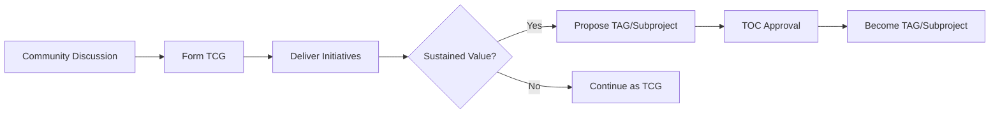

# CNCF Technical Community Groups (TCGs)

Technical Community Groups (TCGs) are lightweight, topic or domain-focused groups that serve as rallying points for community members to discuss, share knowledge, and coordinate potential future initiatives. TCGs are part of the broader [CNCF Community Groups Program](https://github.com/cncf/communitygroups).

## Overview

TCGs provide a structured yet flexible environment for community-driven exploration and collaboration on specific topics within the cloud native ecosystem. They complement Technical Advisory Groups (TAGs) by serving as incubators for ideas and initiatives that may eventually evolve into more formal structures.

:::tip TCG Purpose

Technical Community Groups enable the community to:

- **Discuss and Explore**: Share knowledge and perspectives on emerging topics
- **Build Consensus**: Identify common needs and opportunities
- **Coordinate Work**: Shepherd initiatives with specific deliverables
- **Foster Innovation**: Experiment with new approaches and solutions
- **Grow Leaders**: Develop future TAG and subproject leadership

:::

## Current TCGs

The CNCF currently has three active Technical Community Groups:

### Artificial Intelligence

Focused on artificial intelligence and machine learning in cloud native environments, including AI/ML workloads, frameworks, and infrastructure requirements.

**Topics**: AI/ML infrastructure, model serving, training at scale, MLOps, AI governance

- [Learn more →](./artificial-intelligence/index.md)

---

### Platform Engineering

Dedicated to platform engineering practices, tools, and patterns that enable development teams to self-service their infrastructure needs while maintaining consistency and governance.

**Topics**: Internal developer platforms, golden paths, self-service portals, platform as a product

- [Learn more →](./platform-engineering/index.md)

---

### Software Supply Chain Security

Addressing the security of the software supply chain, from source code to production deployment, including build processes, artifact signing, and provenance tracking.

**Topics**: SBOM, artifact signing, provenance, build security, vulnerability management, supply chain attestation

- [Learn more →](./software-supply-chain-security/index.md)

## How TCGs Work

### Structure

TCGs have minimal governance requirements compared to TAGs:

- **Organizers**: Domain experts who facilitate meetings and coordinate activities (2-year terms)
- **Open Participation**: Anyone can join and participate in discussions
- **Initiative-Driven**: Work is organized through lightweight initiatives with clear deliverables
- **Community-Focused**: Success measured by community engagement and value delivered

### Meetings

- TCGs typically hold regular public meetings
- Meetings are recorded and made available to the community
- No registration required - simply join and participate
- Scheduling is flexible based on community needs

### Communication

TCGs leverage the CNCF Community Groups infrastructure:

- **Bevy Platform**: Community group pages on [community.cncf.io](https://community.cncf.io)
- **Slack Channels**: Dedicated channels on CNCF Slack
- **Mailing Lists**: For announcements and asynchronous discussion
- **GitHub**: For tracking initiatives and deliverables

## TCG vs TAG: What's the Difference?

| Aspect | Technical Community Group (TCG) | Technical Advisory Group (TAG) |
|--------|--------------------------------|-------------------------------|
| **Purpose** | Discussion, exploration, knowledge sharing | Governance, project oversight, deliverables |
| **Structure** | Lightweight, flexible | Formal with chairs and tech leads |
| **Scope** | Topic/domain focused | Industry problem domain or horizontal function |
| **Governance** | Minimal requirements | Comprehensive governance framework |
| **Meetings** | As needed by community | Required monthly public meetings |
| **Deliverables** | Optional initiatives | Required white papers, reviews, assessments |
| **Reporting** | Informal to TOC | Regular status updates to TOC |
| **Lifecycle** | Can be formed/dissolved easily | Long-lived, requires TOC approval |

## Evolution Path

TCGs can evolve into more formal structures:

A TCG may apply to become a TAG or subproject if:

- It has completed numerous initiatives that fill a gap in the current structure
- It has documented collaboration history with existing groups
- It receives TOC approval
- Leadership is established through TAG/subproject processes

## Forming a New TCG

To propose a new Technical Community Group:

### 1. Identify Need

- Is there a clear topic or domain not covered by existing groups?
- Is there community interest and potential participation?
- Are there specific problems or opportunities to explore?

### 2. Draft Proposal

Create a proposal that includes:
- Topic description and scope
- Initial organizers (minimum 2)
- Expected activities and potential deliverables
- Communication plan (meetings, Slack, mailing list)

### 3. Submit for Approval

- Follow the [Community Groups formation process](https://github.com/cncf/communitygroups?tab=readme-ov-file#how-to-apply)
- Obtain TOC approval (required for Technical Community Groups)
- Work with CNCF staff to set up infrastructure

### 4. Launch and Build

- Announce the group to the community
- Hold inaugural meeting
- Start building engagement and delivering value

## Getting Involved with TCGs

TCGs welcome broad participation:

### Join Discussions

- Visit [community.cncf.io](https://community.cncf.io) to find TCG pages
- Join TCG Slack channels for real-time discussion
- Subscribe to mailing lists for updates

### Attend Meetings

- Check TCG pages for meeting schedules
- No registration required - simply join
- Bring your questions, ideas, and experiences

### Contribute to Initiatives

- Volunteer for specific deliverables or tasks
- Share expertise and domain knowledge
- Help with research, documentation, or outreach

### Become an Organizer

- Actively participate in TCG activities
- Demonstrate domain expertise and leadership
- Express interest to current organizers
- Serve 2-year terms with potential renewal

## TCG Requirements

All TCGs must meet basic requirements:

:::info Core Requirements

- **Organizers**: Minimum of 2 organizers who facilitate activities
- **Public Meetings**: Hold meetings open to all community members
- **Communication Channels**: Maintain active Slack channel and/or mailing list
- **Code of Conduct**: Adhere to [CNCF Code of Conduct](https://github.com/cncf/foundation/blob/main/code-of-conduct.md)
- **Regular Activity**: Demonstrate ongoing community engagement and value
- **Technical Leadership Principles**: Follow [CNCF technical leadership principles](https://github.com/cncf/toc/blob/main/PRINCIPLES.md#technical-leadership-principles)

:::

## Resources and Support

### CNCF Community Groups Program

- **Website**: [community.cncf.io](https://community.cncf.io)
- **GitHub**: [cncf/communitygroups](https://github.com/cncf/communitygroups)
- **Organizer Guide**: [Organizer Roles and Responsibilities](https://github.com/cncf/communitygroups/blob/main/organizer_roles.md)

### Governance

- [TCG Governance](../governance/tech-group-governance.md#technical-community-groups) - Full governance details
- [Technical Leadership Principles](../governance/tech-leadership-principles-guidance.md)

### Contact

- **CNCF Community Groups**: community-groups@cncf.io
- **TOC Slack**: [#toc](https://cloud-native.slack.com/archives/C0MP69YF4)
- **TOC GitHub**: [cncf/toc](https://github.com/cncf/toc)

## Related Resources

- [Technical Advisory Groups (TAGs)](../tags/index.md) - Formal technical governance groups
- [Initiatives](../initiatives/index.md) - Time-bound work efforts
- [TOC](../toc/index.md) - Technical Oversight Committee
- [CNCF Community Groups](https://github.com/cncf/communitygroups) - Broader community groups program